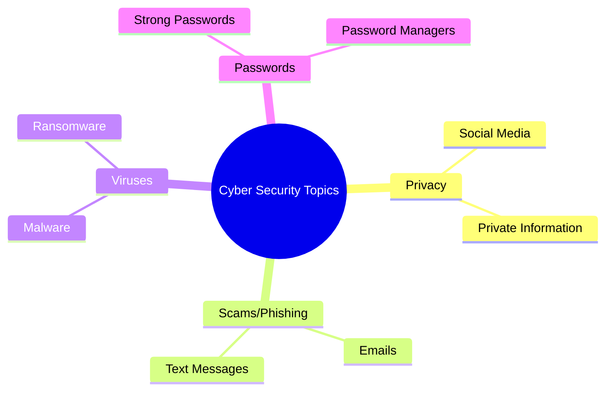

# Survey questions - CAT

---
layout: center
---

# Surveys

- Surveys are a way to collect information from people
- Surveys can be used to find out what people think about something
- We are using surveys to find out what people *know* about our cybersecurity topic and what they *do* about it.

---
layout: center
---

# Our first Common Assessment Task (CAT)

- **In groups**, you will choose a topic from the areas we have covered in class:
    - Privacy, Viruses, Passwords, Phishing/Scams
- You will write 3 questions to identify people's **knowledge** of your topic
- You will write 3 questions to identfy people's **behaviour** about your topic
- You will put your survey questions into a Google Form, and send it to your classmates as well as friends and family
- **Individually** you will analyse the results of your survey in Excel and create a graph to demonstrate your findings.

---
layout: two-cols

---

# Today you need to:

- Find a group. Each group will have <strong style="color:green;">2 or 3 people</strong>.
- Choose your topic area
- Write 3 questions to identify people's **knowledge** of your topic
- Write 3 questions to identify people's **behaviour** about your topic
- Have Mr Matheson check your questions
- (If you have time) Start putting your questions into a Google Form

::right::

## Topic ideas:

   

---
layout: center
---

# What makes a good survey question?

- Questions should be **clear** and **easy to understand**
- Questions should be **specific**
- Questions should be **relevant** to your topic
- It is a good idea to include at least once scenario-based question e.g. "If you received a text message from your bank asking you to click a link, what would you do?"

 

# What makes a question easy to analyse?

- Questions that use multiple choice answers, yes/no answers, or rating scales (1-5) are easier to analyse than textbox questions
- Knowledge questions with one correct answer
- Behaviour questions that ask about frequency (e.g. "How often do you...") or likelihood (e.g. "How likely are you to...")

---
layout: two-cols
---

# Today you need to:

- Find a group. Each group will have <strong style="color:green;">2 or 3 people</strong>.
- Choose your topic area
- Write 3 questions to identify people's **knowledge** of your topic
- Write 3 questions to identify people's **behaviour** about your topic
- Have Mr Matheson check your questions
- (If you have time) Start putting your questions into a Google Form

::right::

## Topic ideas:

   

---