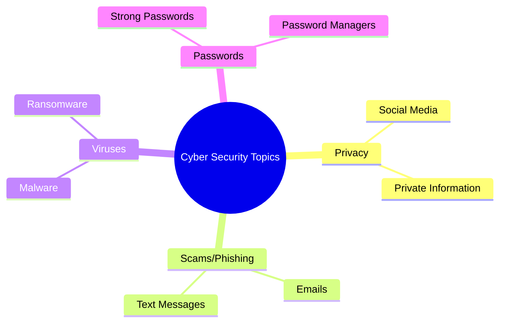

# Survey questions - CAT

---
layout: center
---

# Surveys

- Surveys are a way to collect information from people
- Surveys can be used to find out what people think about something
- We are using surveys to find out what people *know* about our cybersecurity topic and what they *do* about it.

---
layout: center
---

# Our first Common Assessment Task (CAT)

- **In groups**, you will choose a topic from the areas we have covered in class:
    - Privacy, Viruses, Passwords, Phishing/Scams
- You will write 3 questions to identify people's **knowledge** of your topic
- You will write 3 questions to identfy people's **behaviour** about your topic
- You will put your survey questions into a Google Form, and send it to your classmates as well as friends and family
- **Individually** you will analyse the results of your survey in Excel and create a graph to demonstrate your findings.

---
layout: two-cols

---

# Today you need to:

- Find a group. Each group will have <strong style="color:green;">2 or 3 people</strong>.
- Choose your topic area
- Write 3 questions to identify people's **knowledge** of your topic
- Write 3 questions to identify people's **behaviour** about your topic
- Have Mr Matheson check your questions
- (If you have time) Start putting your questions into a Google Form

::right::

## Topic ideas:

   

---
layout: center
---

# What makes a good survey question?

- Questions should be **clear** and **easy to understand**
- Questions should be **specific**
- Questions should be **relevant** to your topic
- It is a good idea to include at least once scenario-based question e.g. "If you received a text message from your bank asking you to click a link, what would you do?"

 

# What makes a question easy to analyse?

- Questions that use multiple choice answers, yes/no answers, or rating scales (1-5) are easier to analyse than textbox questions
- Knowledge questions with one correct answer
- Behaviour questions that ask about frequency (e.g. "How often do you...") or likelihood (e.g. "How likely are you to...")

---
layout: two-cols
---

# Today you need to:

- Find a group. Each group will have <strong style="color:green;">2 or 3 people</strong>.
- Choose your topic area
- Write 3 questions to identify people's **knowledge** of your topic
- Write 3 questions to identify people's **behaviour** about your topic
- Have Mr Matheson check your questions
- (If you have time) Start putting your questions into a Google Form

::right::

## Topic ideas:

   

---
layout: cover
class: text-center
background: /img/speech.webp
hideInToc: false
transition: fade
---

# Using Google Forms

---
layout: li
---

::li::
- To be able to create a Google Form
- To be able to apply appropriate question types to your survey questions
- To be able to share your Google Form with others

::sc::
- My group has created a Google Form that we all have access to
- I can send my family and friends the link to my Google Form

---
layout: center
zoom: 1.2
---

# First: the rubric

## Part 1 - Survey Questions

| Criteria | Below Level | At Level | Above Level |
|----------|-------------|----------|-------------|
| Part 1 - Forming Survey Questions | Student has formed questions that collect information about cyber-security. | Student has created questions that cover knowledge and practice of survey respondents. | Student produced questions that show detailed knowledge of cyber security topic. |
| Part 1 - Identifying Question Types | Student used a question type that tested either knowledge or practice. | Student provided questions that use multiple question types | Student's question types well suited to the question being asked |

---
layout: center
zoom: 1.2
---

## Part 2 - Producing Survey

| Criteria | Below Level | At Level | Above Level |
|----------|-------------|----------|-------------|
| Part 2 - Producing Survey | Student’s survey includes consent statement and questions. | Student’s survey includes relevant title and clear instructions for answering questions. |  |

---
layout: center
zoom: 1.2
---

## Part 3 - Gathering Responses

| Criteria | Below Level | At Level | Above Level |
|----------|-------------|----------|-------------|
| Part 3 - Gathering Responses | Student has received responses | Student has received 20 or more responses |  |

---
layout: center
---

# The Consent Statement

A consent statement is a message that tells people what they are agreeing to when they fill out your survey. For this survey, we have prepared a consent statement for you to use. You can copy and paste it from the lesson plan into your Google Form.

"This survey is voluntarily collecting anonymous data from friends and families of Year 7 Digital Technology students on the cyber security topic of ______. The information collected will only be used for purposes of investigating the knowledge and practices of our community and will not be gathering personal or private data. The responses will be analysed using Excel and graphs produced to provide a summary of our findings. 

If you are happy to complete this survey, please continue."

---
layout: center
---

# Creating a Google Form

- Go to [Google Forms](https://forms.google.com)
    - Log in with your @schools.vic.edu.au email address. 
- Click on the **+** button to create a new form
- Give your form a title
- Add your Team members as collaborators
    - Click on the Share button 
    - Type their email address
    - Change "Responder" to "Editor"
    - Click Send
- Start adding questions to your form

---