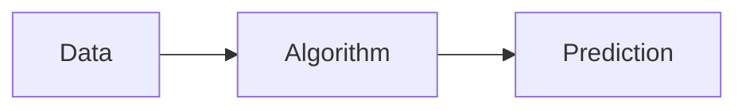

# Artificial Intelligence - Intro

## What is Artificial Intelligence?

---
layout: li
---

::li::
- To be able to describe what the term "Artificial Intelligence" means
- To be able to discuss the 5 "Big Ideas" of AI

::sc::
- Apply the 5 "Big Ideas" of AI to a real-world example

---
layout: center
zoom: 1.4
---

# AI Booklet - Lesson 1 Activity 1

In the space provided, write 5-8 words that come to mind when you think about Artificial Intelligence

---
layout: center
zoom: 1.4
---

# What does "Artificial" mean?

<v-clicks>

- Made by humans
- Not natural
- Might be created by machines/technology
- Imitates something that is natural

</v-clicks>

---
layout: center
zoom: 1.4
---

# What does "Intelligence" mean?

<v-clicks>

- **Understands** its environment (the world around it)
- **Learns** over time
- **Makes plans** on its own
- **Interacts** with its environment
    - Can do things in the world
- Has **impact** on the world
</v-clicks>

---
layout: center
zoom: 1.7
---

# What is Artificial Intelligence?
 

A *program* made by people that makes computers do things that *seem intelligent* (or smart) in the same way that humans are intelligent

---
layout: center
zoom: 1.2
---

# The 5 Big Ideas of AI

1. It can **understand** its environment
2. It can **plan** and make decisions
3. It can **learn** new knowledge and skills
4. It can **interact** with humans and the environment
5. It has an **impact** on the world

---
layout: center
zoom: 1.2
---

# Aibo - Sony's Robot Dog

<Youtube id="CdQnfga65W0" width=550 height=350 />

---
layout: center
zoom: 1.2
---

# Waymo - Self-driving Cars

<Youtube id="uHbMt6WDhQ8" width=550 height=350 />

---
layout: center
zoom: 1.4
---

# Complete the booklet

## AI Lesson 1 - Activity 2

For each of the 5 Big Ideas of AI, describe how they relate to the Aibo and Waymo examples.

---
layout: cover
zoom: 1.3
---

# How do machines become "intelligent"?

---
layout: center
zoom: 1.5
---

# Parts of Machine Learning

