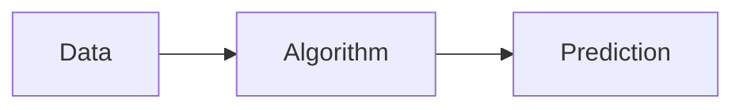
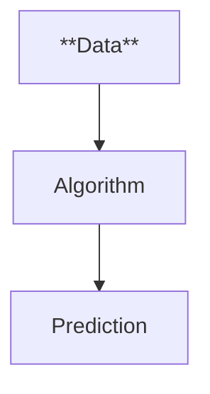
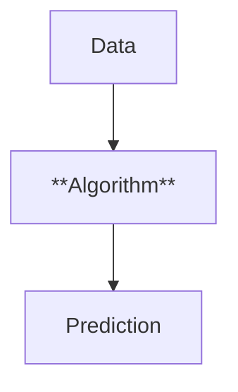
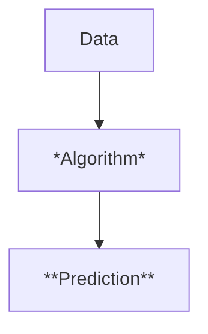

# Artificial Intelligence - Intro

## What is Artificial Intelligence?

---
layout: section
---

## Slides adapted from DayOfAIaustralia.com

*Used under Creative Commons Attribution-NonCommercial 4.0 International License*

---
layout: li
---

::li::
- To be able to describe what the term "Artificial Intelligence" means
- To be able to discuss the 5 "Big Ideas" of AI

::sc::
- Apply the 5 "Big Ideas" of AI to a real-world example

---
layout: center
zoom: 1.4
---

# AI Booklet - Lesson 1 Activity 1

In the space provided, write 5-8 words that come to mind when you think about Artificial Intelligence

---
layout: center
zoom: 1.4
---

# What does "Artificial" mean?

<v-clicks>

- Made by humans
- Not natural
- Might be created by machines/technology
- Imitates something that is natural

</v-clicks>

---
layout: center
zoom: 1.4
---

# What does "Intelligence" mean?

<v-clicks>

- **Understands** its environment (the world around it)
- **Learns** over time
- **Makes plans** on its own
- **Interacts** with its environment
    - Can do things in the world
- Has **impact** on the world
</v-clicks>

---
layout: center
zoom: 1.7
---

# What is Artificial Intelligence?
 

A *program* made by people that makes computers do things that *seem intelligent* (or smart) in the same way that humans are intelligent

---
layout: center
zoom: 1.2
---

# The 5 Big Ideas of AI

1. It can **understand** its environment
2. It can **plan** and make decisions
3. It can **learn** new knowledge and skills
4. It can **interact** with humans and the environment
5. It has an **impact** on the world

---
layout: center
zoom: 1.2
---

# Aibo - Sony's Robot Dog

<Youtube id="CdQnfga65W0" width=550 height=350 />

---
layout: center
zoom: 1.2
---

# Waymo - Self-driving Cars

<Youtube id="uHbMt6WDhQ8" width=550 height=350 />

---
layout: center
zoom: 1.4
---

# Complete the booklet

## AI Lesson 1 - Activity 2

For each of the 5 Big Ideas of AI, describe how they relate to the Aibo and Waymo examples.

---
layout: cover
zoom: 1.3
background: /img/ai-bg.png
---

# How do machines become "intelligent"?

---
layout: center
zoom: 1.5
---

# Parts of Machine Learning

---
layout: two-cols-header
zoom: 1.1
class: text-center
---

<h1 style="text-align:center;"> Data </h1>

::left::

::right::

### Data is information represented in digital form.

Data can be:
- **Numbers** (time, views, temperature)
- **Text** (novels, articles, blogs)
- **Audio** (speech, music, animal sounds)
- **Images** (photos, drawings)
- **Video recordings** (movies, TV, home videos)

---
layout: two-cols-header
zoom: 1.1
class: text-center
---

<h1 style="text-align:center;"> Datasets </h1>

::left::

::right::

Machines need data to learn from. But not just any data, it needs to be *curated* data - a dataset.

Datasets are collections of data that are organized and structured around a specific topic or purpose.

Examples of datasets:

- **Image datasets**: Images used for training computer vision models
- **Text datasets**: Text used for training natural language processing models
- **Statistical datasets**: Numerical data used for analysis and modeling

Datasets often include labels or annotations that provide extra information about what they contain.

---
layout: two-cols-header
zoom: 1.1
---

<h1 style="text-align:center;"> Algorithms </h1>

::left::

::right::

An algorithm is a procedure for solving a given problem or task.

Algorithms act as an exact list of instructions that do something step by step to do something.

There are lots of unique algorithms in the world of AI. 

Our programs in python are algorithms, and we represented them using Python as well as using flowcharts. 

---
layout: two-cols-header
zoom: 1.0
---

<h1 style="text-align:center;"> Algorithms </h1>

::left::

::right::

# Predictions

A prediction is the output of a machine learning algorithm after it has processed the data.
A prediction is a guess or estimation about something, based on the patterns and relationships learned from the data.

Predictions can take many forms, such as classifications, numerical values, or recommendations. When ChatGPT generates a response, it is making a prediction on the words you want to see next.

---