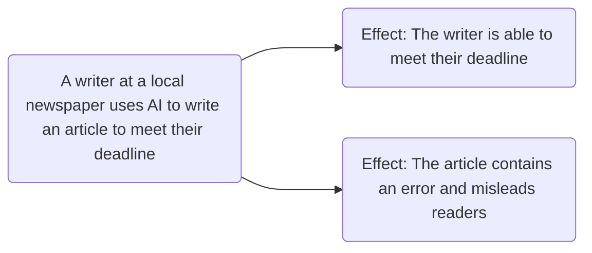

# AI - Ethics
## Lesson 4

---
layout: center
---

## Slides adapted from DayOfAIaustralia.com
*Used under Creative Commons Attribution-NonCommercial 4.0 International License*

---
layout: li
---
::li::

- To be able to describe the ethical concepts of harm and benefit
- To be able to apply harm and benefit to scenarios involving artificial intelligence

::sc::

- Described the potential for harms and benefits in context
- Explored ethical dilemmas in AI

---
layout: section
zoom: 1.3
---

# What is Ethics?

---
layout: center
zoom: 1.3
---

# Ethics is about making choices

<v-clicks depth="3">

- Deciding what is right or wrong
- Considering the impact of our actions on others
- Reflecting on values and principles

</v-clicks>

---
layout: center
---

# Our model of ethics

For today's purpose we will use a simple model of ethics: 

- Harm
- Benefit

---
layout: two-cols-header
zoom: 0.95
---

# Harm and Benefit

The consequences of an action can be called its **"effects"**. We classify the effects of actions into two categories: harm and benefit.

::left::

## Harm

Harm is something that results in a negative effect for a person, or group of people.

Harm can include:

- Psychological harm (feeling anxious or depressed)
- Physical harm (being hurt or injured)
- Emotional harm (feeling sad or scared)
- Social harm (being excluded or bullied)
- Economic harm (losing money or resources)

::right::

## Benefit

Benefits are the positive effects that result from an action or decision.

Benefits can include:
- Psychological benefits (feeling happy or fulfilled)
- Physical benefits (improved health or fitness)
- Emotional benefits (feeling loved or supported)
- Social benefits (building relationships or community)
- Economic benefits (gaining wealth or resources)

---
layout: center
---

# Harm and Benefit in AI

- The writer experiences a *benefit*
    - They meet their deadline
- The readers experience *harm*
    - They are misled by the error in the article

What other benefits and harms can you think of in this scenario?

---
layout: center
---

# Stakeholders

You might have noticed that the people who experienced harm were not the same as those who experienced benefit. Anyone affected by an action is called a **stakeholder**. 

*A stakeholder is anyone who has an interest in or is affected by a decision or action.*

In our newspaper example:
- The *writer* is a stakeholder who benefits from meeting their deadline
- The *readers* are stakeholders who are harmed by the misleading article
- The *newspaper* is a stakeholder that:
    - benefits from the article being published
    - is harmed by the potential loss of trust from readers

---
layout: center
zoom: 1.4
---

# Today's Tasks

## Question 1

Besides the harms and benefits we discussed in the newspaper example: *identify an example of harm and benefit in using AI.*

## Question 2

Arlo is a student who decides to use AI to write his essay for him in English. This results in him receiving the award for the best English student in his year level.

*List 4 stakeholders affected by Arlo's decision to use AI to cheat.*

---

a