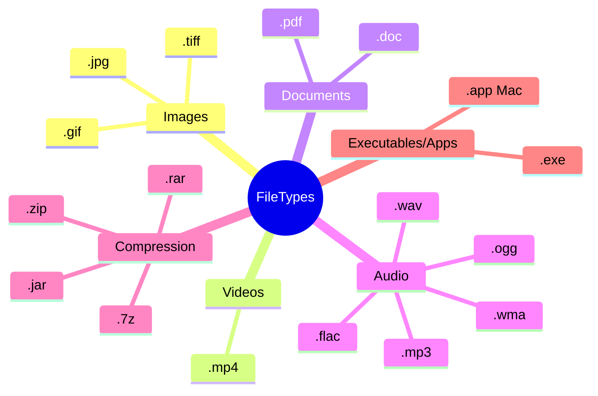

# What is a file?

---
layout: cover
class: text-center
background: https://cover.sli.dev
hideInToc: true
---

# What is a folder?

---
layout: cover
class: text-center
background: https://cover.sli.dev
hideInToc: true
---

# What is a filetype?

---
layout: center
hideInToc: true
---

# Which is the most helpful file name?

Indicate with your fingers which you think would be the best file name.

1. `file1.docx`
2. `english stuff.docx`
3. `assignment 1 - Coraline.docx`
4. `first assignment for english studying Coraline where the parents end up with buttons for eyes.docx`

---
layout: center
hideInToc: true
---

# Which would be the best organised folders?

Indicate with your fingers which you think would be an example of the best way to have your OneDrive folder organised.

1. `Stuff/`
2. `2025/English/Assignments/`
3. `School/English/`
4. `School/English/2025/Term 1/Assignments/Assignment 1/`

---
layout: default
hideInToc: true
---

# Lets Build our Understanding of Filetypes together

---
layout: center
hideInToc: true
zoom: 1.2
---
# Show what you know

Answer the following questions in your book (or on paper). Write both the questions and your answers.

1. In your own words, **why** do we use files?
2. `.pdf` and `.docx` are both document filetypes. Why do you think we have different filetypes for documents?
3. What are **two advantages** of using folders?
4. Lionel has a folder on his computer called "School". Inside that folder he has all his schoolwork, with file names like "schoolwork.docx" and "questions.docx". How could Lionel improve his file management practices?

*These questions are also available on the lesson plan*
