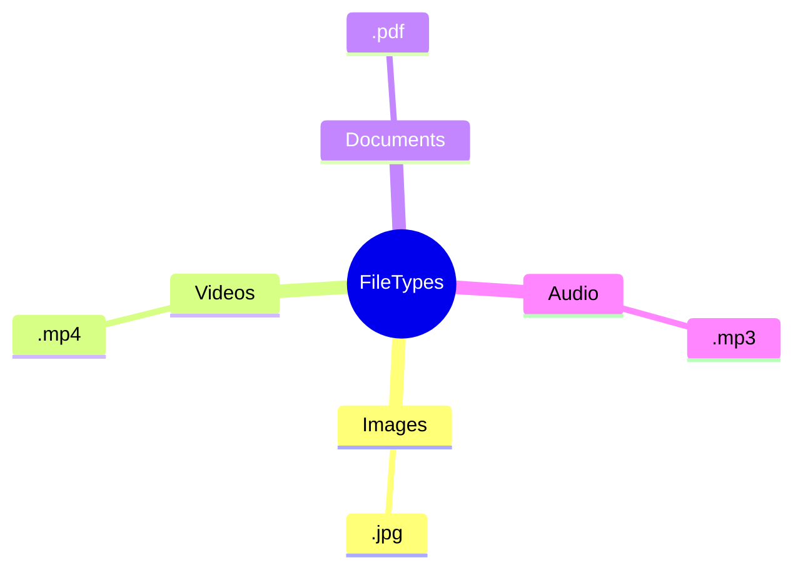

# What is a file?

---
layout: cover
class: text-center
background: https://cover.sli.dev
hideInToc: true
---

# What is a folder?

---
layout: cover
class: text-center
background: https://cover.sli.dev
hideInToc: true
---

# What is a filetype?

---
layout: default
hideInToc: true
---

# Lets Build our Understanding of Filetypes together

---
layout: center
hideInToc: true
zoom: 1.2
---
# Show what you know

Answer the following questions in your book (or on paper). Write both the questions and your answers.

1. In your own words, **why** do we use files?
2. `.pdf` and `.docx` are both document filetypes. Why do you think we have different filetypes for documents?
3. What are **two advantages** of using folders?
4. Lionel has a folder on his computer called "School". Inside that folder he has all his schoolwork, with file names like "schoolwork.docx" and "questions.docx". How could Lionel improve his file management practices?

*These questions are also available on the lesson plan*