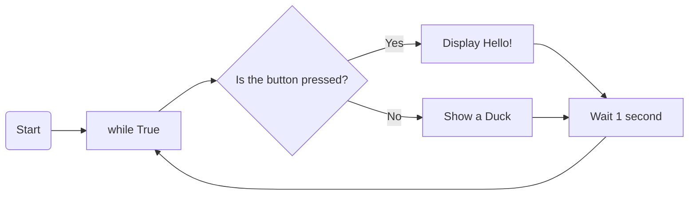
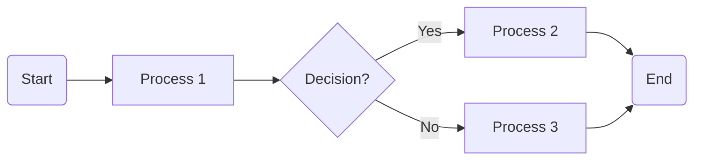

# Your Micro:bit CAT

---
layout: center
zoom: 1.3
---

# What do you need to do?

1. **Select a problem** you want to solve
2. **Design** the solution (including using a flowchart)
3. **Write** the code
4. **Test** the code, documenting your results
5. **Reflect** on the process and results
6. Submit your code and documentation

---
layout: center
---

# Choosing a Problem to Solve

Your problem needs to have: 

- **A clear goal**
- **Input and output**
    - *Input*: Information from the world that goes *into* the micro:bit (eg. button presses, sensor readings, radio messages, etc.)
    - *Output*: Information that goes *out* from the micro:bit to the world (eg. LED display, sounds, radio messages, etc.)
- **Use of multiple micro:bit features** (eg. sensors, buttons, accelerometer, LEDs, radio, etc.)

You can choose a problem from the provided list or choose your own. The more original ideas will be more interesting to work on!

Your problem can (but doesn't have to) use more that one micro:bit if you would like, and they can be running the same or different code from one another. 

---
layout: center
zoom: 1.3
---

# Project Example Ideas

- A simple game (e.g. rock-paper-scissors, a quiz, etc.)
- A weather station that displays temperature from another micro:bit
- Game show buzzers (uding buttons to buzz in and a control micro:bit to see who buzzed in first)
- A virtual pet that responds to button presses and displays emotions on the LED screen

---
layout: center
---

# Using a Flowchart

A flowchart is a visual representation of the steps in your program. It helps you plan the logic before you start coding.

---
layout: center
---

# Flowchart Basics:

- **Start/End**: Represented by rounded rectangles (e.g., Start, End).
- **Processes**: Represented by rectangles (e.g., Display Hello!).
- **Decisions**: Represented by diamonds (e.g., Is the button pressed?).
- **Arrows**: Show the flow of the program.

---
layout: center
zoom: 1.3
---

# Your Turn: Goldilocks 
(Flowchart Example # 1)

Goldilocks walks into the house, and keeps trying porridge until she finds one that is just right. Once she finds the best bowl of porridge, she will eat it all. If she doesn't find one that is just right, she will just go hungry. Draw this as a flowchart on the paper provided.

---
layout: center
zoom: 1.3
---

# Your Turn: Sending and Receiving Messages
(Flowchart Example # 2)

Create a flowchart to show what happens for sending and receiving messages between two micro:bits using the radio module.

*Your micro:bit:*
- Sets the channel
- Listens for a message and scrolls it across the screen if it exists
- Sends "Hi" if you pressed button A
- Loops around again

---
layout: center
---

# Your Task

1. Identify the problem you want to solve. 
2. Complete section 1: **You Do: Selecting a problem**
    - Describe the problem you are solving
    - List the inputs and outputs
    - Identify whether your problem will include radio communication
3. Create a flowchart for your program. 
    - Write a draft of your flowchart on paper or in your book first
    - Put the final version into the space provided in section 2: **Designing the solution**

---
