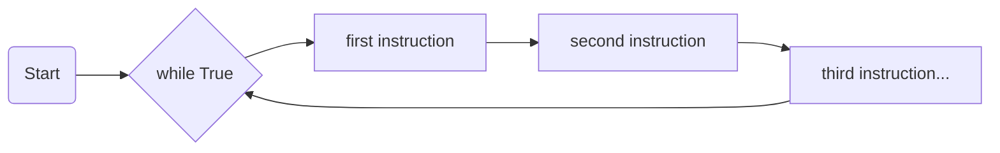
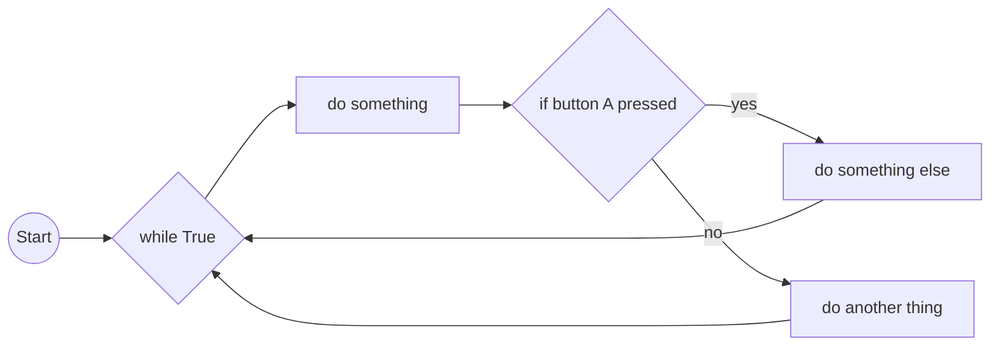

# Programming with Micro:bit

---
layout: center
---

# What is a Micro:bit?

- A small computer that can be programmed to do different things.
- It has sensors, buttons, and lights that can be used to create fun projects.
- It can be programmed using a block-based language (MakeCode) or Python
- **We are using Python, which is a text-based programming language.**

---
layout: two-cols-header
zoom: 0.9
---

# Micro:bit features


::left::

- **LED display**: 5x5 grid of lights that can show images or text.
- **Buttons**: Two buttons (A and B) that can be pressed to trigger actions.
- **Accelerometer**: Detects movement and orientation.
- **Compass**: Measures direction (North, South, East, West).
- **Temperature sensor**: Measures the temperature.

::right::
- **Bluetooth/Radio**: Allows the Micro:bit to connect to other devices wirelessly.
- **USB port**: Used to connect the Micro:bit to a computer for programming.
- **Power supply**: Can be powered by batteries or USB.
- **Pins**: 25 pins that can be used to connect to other devices or sensors.

---
layout: center
---

# What is Python?
- Python is currently the most popular programming language in the world.
- It is used by professionals and beginners across many industries.
- It is considered easier to write and read than other programming languages.
- When AI tools like ChatGPT create code to solve problems, they often use Python

---
layout: center
zoom: 1.3
---

# Python basics - Hello World!


```python
print("Hello, World!")
```

- This code prints "Hello, World!" to the terminal or console.
- The `print` function is used to display text or numbers.
- In programming, we store text data in a **string**, shown by putting it in quotation marks.
- When we are coding for Micro:bit, this will only display when the Micro:bit is connected to our computer.

<v-click>

```python
display.scroll("Hello, World!")
```

- This is the *same code*, only **using the Micro:bit display** to scroll the message.

</v-click>

---
layout: image-right
image: /img/simulator.png
---

# The Simulator
<br/>
The Simulator executes your code and shows you what it would look like on the Micro:bit. 

It lets you do everything you can do on the Micro:bit, but without needing to plug it in, and much quicker. 

**We always test on the simulator first**, and then run on the Micro:bit once we have a more complete program.

The controls underneath let you simulate button presses, shake the Micro:bit, adjust the temperature, volume and more.

---
layout: center
---

# Our First Micro:bit Program

<br>

**Open the Micro:bit editor using the Micro:bit Classroom link in the lesson plan.** 

- Write code to scroll a message on the Micro:bit display.
    - Remember: You can use the `display.scroll()` function to scroll text on the Micro:bit display.
    - Don't forget to put the text in quotation marks!
- Test your code on the Micro:bit simulator on the right hand side

<div class="note">

***Note:*** The Micro:bit editor suggests code as you type. This is a great way to learn how to use the Micro:bit library and Python syntax (and makes it less likely that you will make a mistake). If you see a suggestion that you like, press the `Enter` key to accept it.

</div>
---
layout: center
---

# Running Code on the Micro:bit

- Once you have written and tested code in the simulator, we can run code on the Micro:bit
- Because we don't have enough Micro:bits for everyone, we will only use them some of the time
- To run code on the Micro:bit, plug the USB cable into the Micro:bit and your computer
- In the Micro:bit editor, click on the `Send to Micro:bit` button
    - The first time you connect it it will ask to pair with your computer
    - The Micro:bit will appear as a USB drive on your computer
- Once it has **flashed** the code it should run automatically

---
layout: cover
background: /img/microbit-bg.webp
---

# What did you notice?
<br />
<v-clicks>

Did your code run as you expected?

What happened after the message scrolled?

What would make this more interesting?

</v-clicks>
---
layout: center
zoom: 1.1
---

# Infinite Loops

- By default, the Micro:bit will run your code once and then stop.
- To make it run continuously, we need to use a **loop**.
- A loop is a way to repeat a block of code multiple times.
- Python has two main types of loops: `for` loops and `while` loops.
- We use a `while` loop to run our code **FOREVER!!!** (or until we stop it or the battery runs out)

```python{3|all}

from microbit import *

while True:
    display.scroll("Hello, Repetitively!")
```

**NOTE:** The text underneath `while True:` is *indented*. This tells Python which code belongs to the loop. The indentation is important in Python, and uses 4 spaces. 

*If you need to indent code you use the `Tab` key, and to remove indentation you use `Shift + Tab`.*

---
layout: center
zoom: 1.3
---

# Your Turn

- Use the code below to change your Micro:bit program to scroll a message continuously (You can keep your own message).

```python
from microbit import *

while True:
    display.scroll("Go Tiges!")
```

- **Test it in the simulator first**, then if a Micro:bit is available, run it there.

---
layout: center
---

# Showing an image

- The Micro:bit has a built-in LED display that can  show images.
- You can use the `display.show()` function to display an image on the Micro:bit.

```python

from microbit import *

while True:
    display.show(Image.HEART)
```


```python

from microbit import *

while True:
    display.show(Image.HEART)
    sleep(1000) 
    display.show(Image.SAD)
    sleep(1000)  
```

Why do you think I chose 1000?

---
layout: center
---

## Give it a try

```python

from microbit import *

while True:
    display.show(Image.HEART)
```

1. There are a number of other images you can use, including: *`Image.SAD`, `Image.HAPPY`, `Image.SILLY`, `Image.ANGRY`, `Image.CONFUSED`, `Image.YES`, `Image.NO`* - pick one you like and try it out!
2. Add a second image to your code and use the `sleep()` function to pause between them. 


- **Extension**: You can also create your own images using the `Image` class. For example, you can create a windmill image like this:
```python   
display.show(Image("00900:99099:00900:00500:09990"))
```

*0 is completely off, 9 is completely on and the other numbers represent the brightness in between. The colons separate the rows of the image.*

---
layout: center
zoom: 1.4
---

# Packing up your Micro:bit

- Micro:bits are *small, easy to lose and fragile*.
- **Carefully** unplug the USB cable from the Micro:bit and your computer
- Once your **whole table** has the correct number of Micro:bits ready to return, one person from each table should take them to the front of the room.

---
layout: center
zoom: 1.2
---

# Review: Different Parts of the Micro:bit Programs

- **Importing Libraries**: The first line of code imports the Micro:bit library, which gives us access to all the functions and classes we need to use the Micro:bit. **If you don't import the library, words like `display` and `button_a` are meaningless.**
```python
from microbit import *
```

- **While Loop**: The `while True:` line creates an infinite loop that will run the code inside it forever. This is how we make the Micro:bit do something continuously.
```python
while True:
```

---
layout: center
zoom: 1.2
---

# Review - Display reminders


- The `display.show()` function is used to show an image or text on the Micro:bit's LED display. You can use it to show different images or text messages.

```python
display.show(Image.HEART)
```

- The `display.scroll()` function is used to scroll a message across the display. You can use it to show longer messages that don't fit on the screen all at once.

```python
display.scroll("Hello, World!")
```

---
layout: cover
background: /img/microbit-bg.webp
hideInToc: false
---

# Using Input and Making Decisions

---
layout: center
---

# Our programs so far:

- While loop to keep the code repeating
- Instructions run one after the other



---
layout: center
zoom: 1.2
---

# But programs are best when you can do something different!

- When we interact with a program, we call it **input**
- We can use the input to make decisions in our code
- Micro:bit has a number of ways to get input:
    - Buttons (A and B)
    - Accelerometer (shake, tilt, etc.)
    - Temperature sensor
    - Compass (direction)
    - Touch sensor (on the edge of the Micro:bit)

*Today we will focus on using the buttons for input*

---
layout: center
---

# Today's programs



**Note two key differences:**

- The `if` statement is used to check if a condition is true or false.
- The condition we are checking is "button A pressed".
---
layout: two-cols
zoom: 1.1
---

# Code example

```python

from microbit import *

while True:
    if button_a.is_pressed():
        display.show(Image.HAPPY)
    else:
        display.show(Image.SAD)
```

- The `if` statement checks if the condition is true. The indented code only runs if that condition is true
- The `else` statement runs if the condition is false.
- What do you think is going to happen when we run this code?

::right::

<v-clicks>

- We run the code:


- Then we press button A:


</v-clicks>
---
layout: center
zoom: 1.2
---

# `if`, `elif` and `else`
- The `if` statement checks if a condition is true. If it is, the code inside the `if` block runs.
- The `elif` statement (short for "else if") checks **another condition** if the first one is false. If it is true, the code inside the `elif` block runs.
- The `else` statement runs if all previous conditions are false.


```python
from microbit import *

while True:
    if button_a.is_pressed():
        display.show(Image.HAPPY)

    elif button_b.is_pressed():
        display.show(Image.SAD)

    else:
        display.show(Image.SILLY)
```


---
layout: center
---

# Your Turn: Using conditions to respond to input

- Use the code below to create a program that shows a different image when button A is pressed.

```python
from microbit import *

while True:
    if button_a.is_pressed():
        display.show(Image.HAPPY)
    else:
        display.show(Image.SAD)
```

- *Feel free to use a different image for each*
- **Test it in the simulator first**, then if a Micro:bit is available, run it there.
- **Extension**: Add a second button (B) to show a different image when pressed. You can use the `button_b.is_pressed()` function to check if button B is pressed. You might need to use `elif` to check for the second button. Then add a third image that shows when neither button is pressed. You can use the `else` statement to do this.

---
layout: center
hideInToc: false
---

# `and` and `or`: Combining Buttons

- We can use `and` and `or` to check multiple conditions at the same time.
- For example, we can check if both buttons A and B are pressed at the same time.

```python
from microbit import *

while True:
    if button_a.is_pressed() and button_b.is_pressed():
        display.show(Image.HAPPY)
    else:
        display.show(Image.SAD)

```

<v-clicks>

What do you think will happen when we run this code?

</v-clicks>
---
layout: two-cols
zoom: 1.2
---

# `and`

- The `and` operator checks if **both conditions are true**. The code inside an `if` statement  that uses `and` will only run if both conditions are true.

::right::

# `or`

- The `or` operator checks if **at least one of the conditions** is true. The code inside an `if` statement that uses `or` will run if either condition is true.


---
layout: center
zoom: 1.2
---

# Your Turn: Using `and` and `or` to combine buttons

Use the code below to create a program that shows a different image when either buttons A or B are pressed.

```python

from microbit import *
while True:
    if button_a.is_pressed() or button_b.is_pressed():
        display.show(Image.HAPPY)
```

What would the program do if we used `and` instead of `or`?

---
layout: center
---

# Using the Reference, Ideas and API tabs

The Micro:bit editor has three tabs on the left hand side:

- **Reference**: The reference tab has lots of categories for the different things you might want to do with the code.
- **Ideas**: The ideas tab has lots of examples of projects you can do with the Micro:bit. You can use these as inspiration for your own projects.
- **API**: The API tab has a list of all the functions and classes you can use in your code. This does less explaining than the **Reference** tab, but it is a complete list of the available functions and classes.

---
layout: center
zoom: 1.3
---

# Using the Reference Tab

Spend a few minutes exploring the Reference tab. Then discuss with a partner something interesting you found (that you might like to explore further).

---
layout: center
hideInToc: false
zoom: 1.2
---

# Micro:bit - Dealing with Errors

<v-clicks depth="2">

- **All programmers make mistakes when we are coding**
- Errors can be because:
    - We mistyped something or broke the rules of Python (*syntax error*)
    - We used a function or variable that doesn't exist (*name error*)
    - The code doesn't do what we expected (*logical error*)
- Syntax or name errors will show up in the editor with:
    - A red underline in the editor
    - A red circle in the left hand side of the editor (once you have moved away)

</v-clicks>


---

