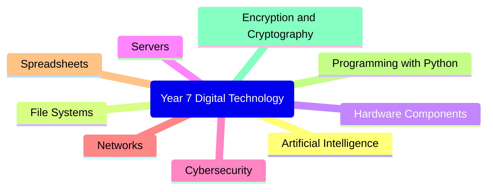

# Review

What have we done this semester?

---
layout: center
transition: fade
---

# Topics

---
layout: two-cols
---

# Your task for today

Create a poster on the best topic you learned this semester

- What was the topic?
- What was best about it?
- What did you learn?

You can use Canva, PowerPoint (just use 1 slide for your poster), or do it on paper.

::right::

## Prizes for:

- Most informative
- Most creative
- Best use of images
- Best group poster
- Best individual poster

Topics: Artificial Intelligence,
    File Systems,
    Hardware Components,
    Servers,
    Cybersecurity,
    Networks,
    Spreadsheets,
    Programming with Python,
    Encryption and Cryptography

Note: Judging will start at 10:50AM

---
